- Adrien Barth et Lionel Burgbacher

## Laboratoire 802.11 Sécurité WPA Entreprise

### 1. Analyse d’une authentification WPA Entreprise

Dans cette première partie, vous allez analyser [une connexion WPA Entreprise](files/auth.pcap) avec Wireshark et fournir des captures d’écran indiquant dans chaque capture les données demandées.

- Comparer [la capture](files/auth.pcap) au processus d’authentification donné en théorie (n’oubliez pas les captures d'écran pour illustrer vos comparaisons !). En particulier, identifier les étapes suivantes :
	- Requête et réponse d’authentification système ouvert
	  - Requête d'authentification du client
	    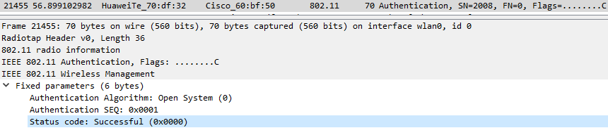
	   	- Réponse de l'AP
	  	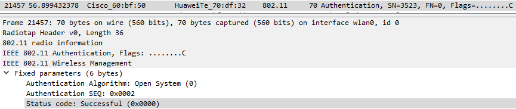
  - Requête et réponse d’association (ou reassociation)
   	- Requête d'association du client
  	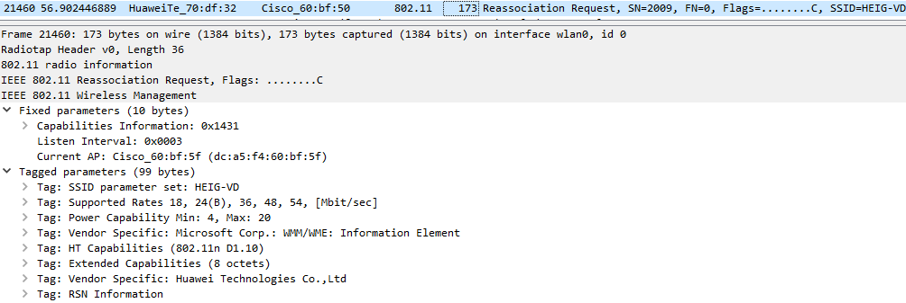
   	- Réponse de l'AP pour l'association
  	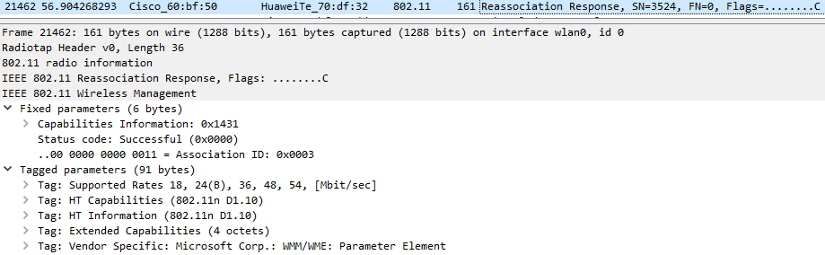
  - Négociation de la méthode d’authentification entreprise
    La négociation de la méthode d'authentification n'a pas été vue dans la théorie. Cette capture nous montre que le serveur peut supporter plusieurs méthodes et va dans un premier temps proposer la plus forte, EAP-TLS, pour ensuite proposer des méthodes supplémentaires si celle-ci n'est pas acceptée.
    - EAP-TLS est proposé dans un premier temps:
      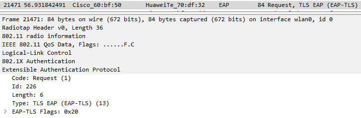
    - Le client refuse...
      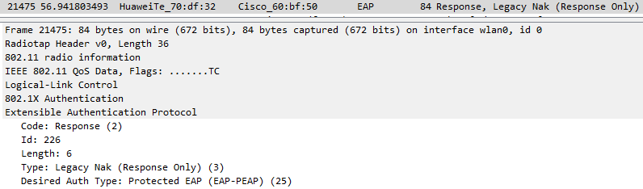
    - PEAP est donc proposé suite au refus du client:
      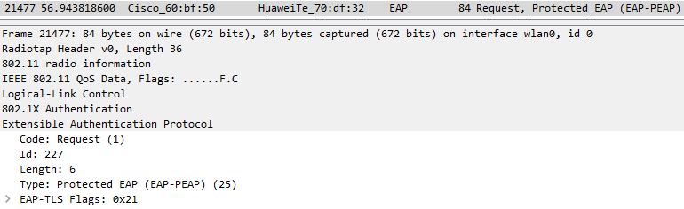
  - Phase d’initiation. Arrivez-vous à voir l’identité du client ?
    Le tunnel TLS n'est pas encore ouvert, il est donc possible de voir que le client est einet\joel.gonin.
    - L'identité du client est réclamée:
      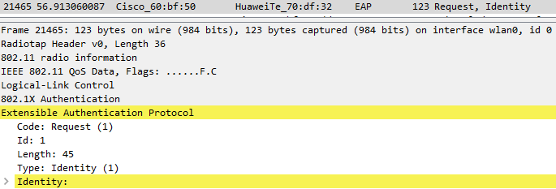
    - Le client répond, on peut le nom d'utilisateur `einet\joel.gonin`:
      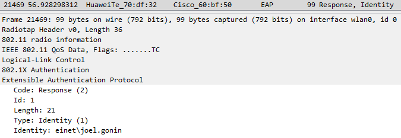
  - Phase hello :
    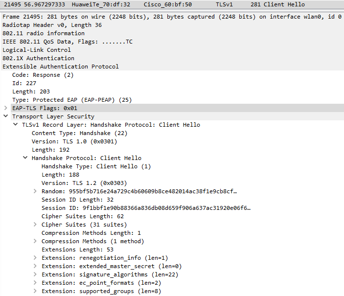
    - Version TLS: TLS 1.2 (0x0303)
    - Suites cryptographiques et méthodes de compression proposées par le client et acceptées par l’AP
      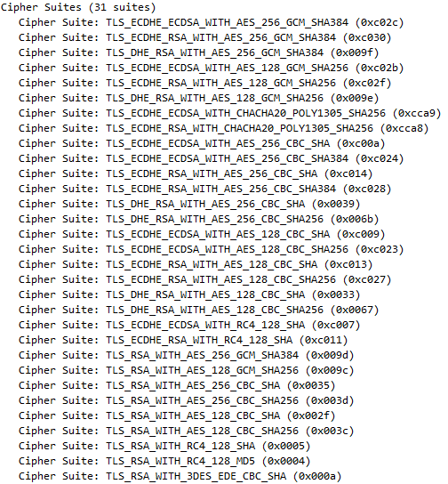
    - Méthode de compression: 1
    - Nonces
      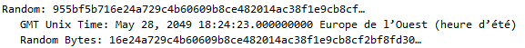
    - Session ID: 9f1bbf1e90b88366a836db08d659f906a637ac31920e06f622762ca6c522a64f
  - Phase de transmission de certificats
    - Le serveur décline son identité en envoyant son certificat:
      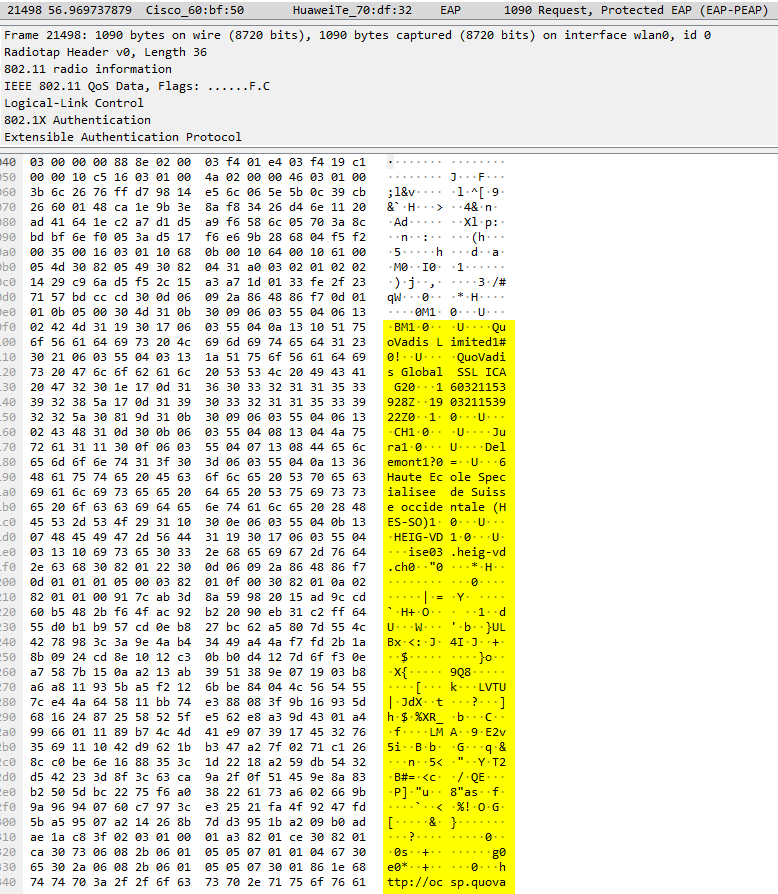
    - Le client n'a pas de certificat à envoyer mais accepte celui du serveur:
      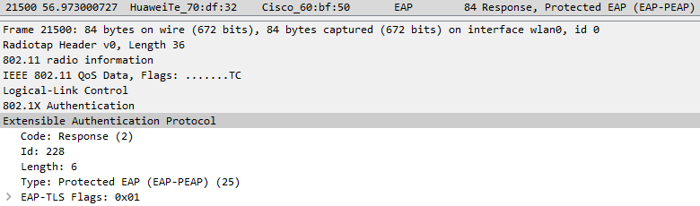
    - Echanges des certificats
    - Change cipher spec = début de la communication chiffrée:
      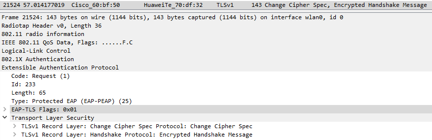
  - Authentification interne et transmission de la clé WPA (échange chiffré, vu comme « Application data »)
    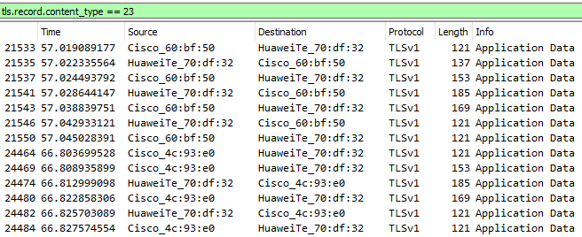
  - Et finalement le 4-way handshake standard:
    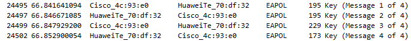

### Répondez aux questions suivantes :

> **_Question :_** Quelle ou quelles méthode(s) d’authentification est/sont proposé(s) au client ?
> 
> **_Réponse :_**  EAP-TLS est proposé en premier, le client refuse et se voit proposer PEAP qu'il accepte.

---

> **_Question:_** Quelle méthode d’authentification est finalement utilisée ?
> 
> **_Réponse:_**  PEAP

---

> **_Question:_** Lors de l’échange de certificats entre le serveur d’authentification et le client :
> 
> - a. Le serveur envoie-t-il un certificat au client ? Pourquoi oui ou non ?
> 
> **_Réponse:_** Oui le serveur envoi un certificat. Celui-ci est nécessaire pour que le client puisse valider l'identité du serveur et ne pas être sur un réseau malveillant.
> 
> - b. Le client envoie-t-il un certificat au serveur ? Pourquoi oui ou non ?
> 
> **_Réponse:_** Non, PEAP utilise une authentification username/password, un certificat n'est pas nécessaire
> Avec EAP-TLS, le client aurait du envoyer un certificat pour s'authentifier au lieu du username/password.

## Livrables

Un fork du repo original . Puis, un Pull Request contenant :

-	Captures d’écran + commentaires
-	Réponses aux questions

## Échéance

Le 1 juin 2020 à 23h59